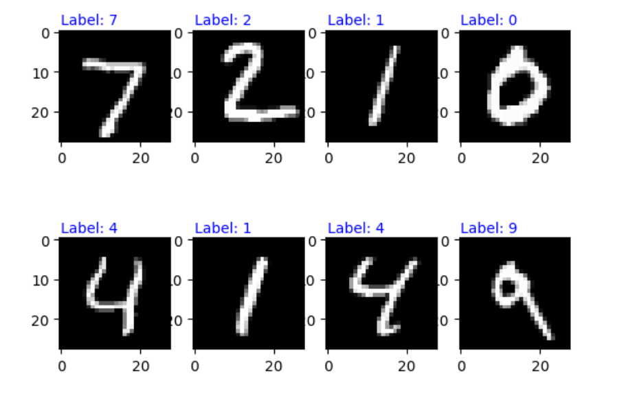

# MLP Digit Recognition with MNIST

This project provides a platform for training a Multi-Layer Perceptron (MLP) neural network using the MNIST dataset. The main objective is to familiarize with the basic concepts of deep learning and image processing by building and training an MLP to recognize handwritten digits in the MNIST dataset.

## Features

- Train a Multi-Layer Perceptron (MLP) on the MNIST dataset
- Recognize and classify handwritten digits

